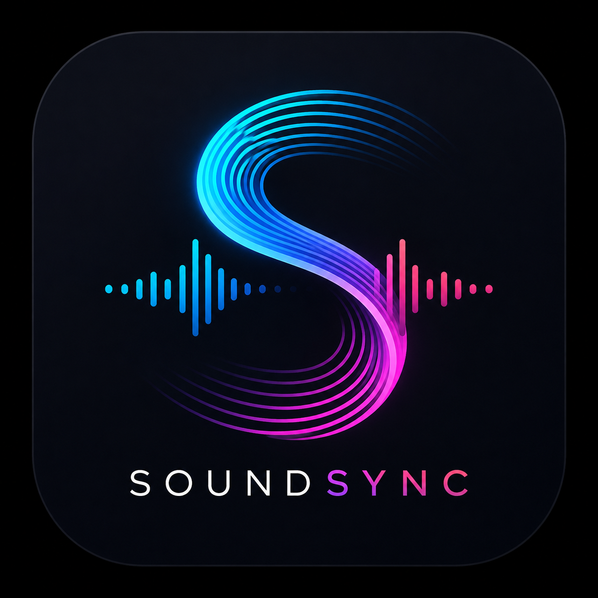

<p align="center">
  
</p><h1 align="center">SoundSync</h1><p align="center">
  <strong>An Android music library, playback, analysis, and DJ utility app built with Kotlin and Jetpack Compose.</strong>
</p><p align="center">
  <a href="https://github.com/jtmeaker-hash/Sound-sync/actions/workflows/build-apk.yml"></a>
  
  
</p>About

SoundSync is a music-focused Android app designed to bring local library management, DJ-style audio analysis, playback controls, metadata enrichment, streaming-service browsing, cloud access, and music discovery tools into one place.

The project is aimed at people who keep their own music library but still want modern streaming and cloud conveniences without giving up direct access to their files.

«[!IMPORTANT]
SoundSync is under active development. Features, APIs, UI, metadata behaviour, and playback internals may change between builds.»

Features

Local music library

- Scan audio stored on the device.
- Browse the library by Songs, Albums, Artists, Playlists, and Folders.
- Browse directly through selected file locations instead of relying only on a flattened library view.
- Search the local library.
- Detect duplicate tracks to help avoid repeated imports.
- Inspect track and file properties.
- Create and manage local playlists.
- M3U playlist support with Rockbox-oriented path handling.

Playback

- Full-screen Now Playing experience.
- Background playback through an Android media playback service.
- Notification/media controls for playback outside the app.
- Queue-based continuous playback.
- Previous/next track navigation.
- Shuffle support.
- Repeat Off / Repeat All / Repeat One modes.
- Adjustable crossfade controls.
- Switchable album-art and waveform-focused Now Playing views.

Waveform, spectrogram, and audio analysis

- Track-specific waveform generation and caching.
- Rekordbox-inspired scrolling waveform display.
- Spectrogram generation and analysis.
- Local PCM analysis for BPM and musical key data.
- Camelot key representation.
- Bitrate and audio-quality inspection.
- Analysis metadata and confidence information where available.

Metadata enrichment

SoundSync uses MusicBrainz as the primary external catalogue for canonical track identity and release metadata.

Metadata enrichment can include:

- Track title
- Artist and artist credits
- Album/release information
- MusicBrainz recording, artist, release, and release-group IDs
- ISRC
- Release date/year
- Track and disc number
- Label
- Barcode
- Country and release status
- Genre/tags when available
- Cover artwork through MusicBrainz-linked release data / Cover Art Archive

BPM and musical key are intentionally handled through local audio analysis or existing persisted values rather than being blindly replaced by remote catalogue data.

### DJ Tools & Real-Time Audio Processing

SoundSync provides fully functional DJ audio tools with real DSP and live PCM analysis:

- **Metronome**: Standalone high-precision monotonic audio clock with audible PCM click, user-selectable BPM (30–300 BPM), manual tap tempo sync, and drift-free operation.
- **Tap BPM / Tap Tempo**: Accurate tempo calculation from real-time taps using rolling interval averaging, outlier smoothing, and inactivity reset.
- **Key Converter**: Harmonic mixing tool translating standard musical keys (e.g., C Major, A Minor) to Camelot wheel notation and Open Key codes, with compatible key recommendations for harmonic DJ transitions.
- **RMS Meter**: Real decibel RMS loudness meter analyzing actual PCM audio frames, showing average dB, peak levels, and live visual meter indicators.
- **Clipping Detector**: PCM peak amplitude monitoring with configurable ceiling threshold (-0.1 dBFS), clipped sample counters, and true headroom calculation.
- **Dynamic Range Meter**: Audio dynamics analyzer calculating crest factor (peak-to-RMS ratio) and official DR dynamic range ratings.
- **Multipoint Parametric EQ**: Real Android platform audio effects equalizer with live low/mid/high frequency gain sliders (-12 dB to +12 dB) persisting across playback state changes and track transitions.
- **Haas Surround**: Controlled inter-channel micro-delay (1–30 ms) stereo widening effect with mono-safe phase control and zero playback glitches.

### Song Finds

Hear something good in a Reel, TikTok, YouTube video, Spotify link, SoundCloud link, or another app?

SoundSync appears in Android's system Share sheet to capture incoming links as Song Finds, allowing you to organize, tag, and locate tracks to add to your local library.

### Streaming Integrations

The app contains unified streaming browsing and playback with integrations for:

- **Spotify**: OAuth/PKCE authentication, saved library browsing, playlists, and track search.
- **SoundCloud**: Client ID API integration, stream URL resolution, and search.

> [!NOTE]
> Streaming features depend on third-party service APIs and user account credentials. SoundSync does not bypass service restrictions or DRM.

### AI Generation Tools

Quickly launch external AI music creation suites with track context copied to clipboard:
- **Suno**: Deep link opener with browser fallback.
- **ACE Studio**: Direct package opener with browser fallback.

### GitHub Releases & Update System

SoundSync connects directly to GitHub Releases for app version discovery and clean updates:

- **Automatic & Manual Checks**: Periodically queries GitHub Releases in the background (or on demand) and performs strict semantic version comparison (e.g., `1.10.0` > `1.9.0`).
- **Two-Step Update Flow**:
  1. *Update Notification*: Displays installed vs. available version, download size, and full release notes.
  2. *Prepare Update & Data Notice*: Explains the update procedure and explicitly warns that internal application data (settings, local database cache, internal playlists) will be reset upon uninstallation, while external audio files stored on device storage remain safe.
- **Clean Uninstall/Reinstall Sequence**: Verifies browser availability, launches the [Latest GitHub Release Page](https://github.com/jtmeaker-hash/Sound-sync/releases/latest) in an independent browser task, and immediately prompts Android's system package uninstall (`Intent.ACTION_DELETE`). No background APK downloading, package installer permissions, or in-app overwrites are performed.

### Navigation Architecture

SoundSync features a streamlined dual navigation architecture:

1. **Bottom Navigation Bar**:
   - **Local**: Songs, Albums, Artists, Playlists, and direct Folder file browsing.
   - **Finds**: Saved song links captured from external apps.
   - **Streaming**: Spotify and SoundCloud catalog integration.
   - **Spectrogram**: Real-time STFT frequency heatmap and cutoff inspection.

2. **Side Navigation Drawer (☰)**:
   - **AI Generation**: Suno & ACE Studio integrations.
   - **DJ Tools**: Metronome, Tap BPM, Key Converter, RMS Meter, Clipping Detector, Dynamic Range Meter, Multipoint EQ, Haas Surround.
   - **Streaming**: Spotify & SoundCloud configuration.
   - **Playback & Audio**: Adjustable crossfade, repeat modes, and shuffle controls.
   - **Library & Storage**: Storage sources, MusicBrainz metadata enrichment settings, MediaStore scanner, and cache cleanup.
   - **App & Interface**: Theme selection (Obsidian DJ Dark / Light / System) and GitHub Updates manager.

Requirements

To run the app

- Android 7.0 / API 24 or newer.
- Storage/media permission for local audio access.
- Notification permission on Android versions that require it for media notifications.
- Internet access for online metadata, cloud, streaming, and update features.

To build from source

Recommended development environment:

- Android Studio
- JDK 21
- Android SDK / compile SDK 36
- Git

The project currently targets Android API 36 and has a minimum SDK of 24.

Build from source

Clone the repository:

git clone https://github.com/jtmeaker-hash/Sound-sync.git
cd Sound-sync

Create your local environment file:

cp .env.example .env

The included ".env.example" contains the optional Gemini API key placeholder used by AI-assisted functionality:

GEMINI_API_KEY=MY_GEMINI_API_KEY

Do not commit real API keys or secrets to the repository.

Run unit tests:

```bash
./gradlew testDebugUnitTest
```

Build a debug APK:

```bash
./gradlew assembleDebug
```

The debug APK will be located at:
`app/build/outputs/apk/debug/app-debug.apk`

Build a signed release APK:

```bash
./gradlew assembleRelease
```

The release APK will be located at:
`app/build/outputs/apk/release/app-release.apk`

On Windows, use `gradlew.bat` instead of `./gradlew`.

### Installing from GitHub Releases

Ready-to-install APK packages are published directly on GitHub:

1. Visit the [SoundSync GitHub Releases](https://github.com/jtmeaker-hash/Sound-sync/releases/latest) page.
2. Download the latest `.apk` asset.
3. If upgrading an existing installation, uninstall the current version first to ensure a clean database migration, then tap the downloaded APK to install.

Service configuration

Spotify

SoundSync supports a configurable Spotify Client ID from the app's API configuration UI.

OAuth redirect URI:

`soundsync://spotify-callback`

Add the same redirect URI to the Spotify developer application used with SoundSync.

SoundCloud

SoundCloud also uses a configurable Client ID.

OAuth redirect URI:

`soundsync://soundcloud-callback`

Your SoundCloud application must allow the matching redirect URI.

Google Drive

Google Drive authentication returns through:

`soundsync://gdrive-callback`

Google OAuth configuration must match the credentials and redirect behaviour expected by the app.

Permissions

Depending on Android version and enabled features, SoundSync may request permissions for:

- Internet access (`android.permission.INTERNET`)
- Audio/media library access (`READ_MEDIA_AUDIO` on Android 13+, `READ_EXTERNAL_STORAGE` on older versions)
- Legacy storage access (`WRITE_EXTERNAL_STORAGE` on Android 12 and below)
- Foreground media playback (`FOREGROUND_SERVICE_MEDIA_PLAYBACK`)
- Foreground data-sync work (`FOREGROUND_SERVICE_DATA_SYNC`)
- Media control and update notifications (`POST_NOTIFICATIONS`)

Permissions are requested on demand only when you use the related feature.

Technology

SoundSync is currently built around:

- Kotlin
- Jetpack Compose / Material 3
- Android Media / foreground playback services
- Room database
- Kotlin Coroutines / Flow
- Retrofit + OkHttp
- Moshi
- Coil
- WorkManager
- Storage Access Framework / DocumentFile
- MusicBrainz and Cover Art Archive integration
- GitHub Actions for CI and release builds
- Robolectric / AndroidX testing

Project structure

app/src/main/java/com/example/
├── analysis/      # Duplicate detection, tagging and analysis services
├── audio/         # Playback engine, waveform, spectrogram, EQ and Haas DSP
├── data/          # Room database, DAOs and entities
├── metadata/      # Embedded metadata, MusicBrainz and local audio analysis
├── network/       # GitHub, Spotify, SoundCloud and Google Drive networking
├── service/       # Audio scanning and background media playback
├── storage/       # Local scanning, SAF, M3U/Rockbox and file utilities
├── streaming/     # Streaming-provider abstractions
├── sync/          # Cloud/local sync logic
├── ui/            # Compose screens, components and ViewModel
└── update/        # GitHub release update checking and installation

CI / GitHub Actions

The primary workflow is:

.github/workflows/build-apk.yml

It runs on pushes and pull requests targeting "main", and can also be started manually.

For release signing, configure the appropriate GitHub repository secrets rather than committing keystore passwords or private signing material.

Development status

SoundSync is evolving quickly. Current development is focused heavily on:

- Reliable continuous playback and queue behaviour.
- Accurate waveform-to-audio synchronisation.
- Stable track switching without stale audio state.
- Consistent BPM/key analysis coverage.
- Reliable metadata matching and enrichment.
- Smooth local-library browsing and search.
- Stable streaming/cloud authentication flows.
- Performance and crash reduction on real Android devices.

Bug reports with reproducible steps, device/Android version, logs, and the build version are especially useful.

Contributing

Contributions, testing, bug reports, and focused pull requests are welcome.

A useful contribution should ideally:

1. Describe the problem clearly.
2. Keep unrelated changes out of the same PR.
3. Preserve existing working playback and library behaviour.
4. Add or update tests when practical.
5. Confirm that "./gradlew testDebugUnitTest" passes.
6. Confirm that "./gradlew assembleDebug" succeeds.

Repository

GitHub: https://github.com/jtmeaker-hash/Sound-sync

License

A project license has not yet been specified in this repository. Add a "LICENSE" file before treating the project as licensed for redistribution or reuse.

---

<p align="center">
  <strong>SoundSync — local library control with DJ-focused tools, modern metadata, and connected music workflows.</strong>
</p>
