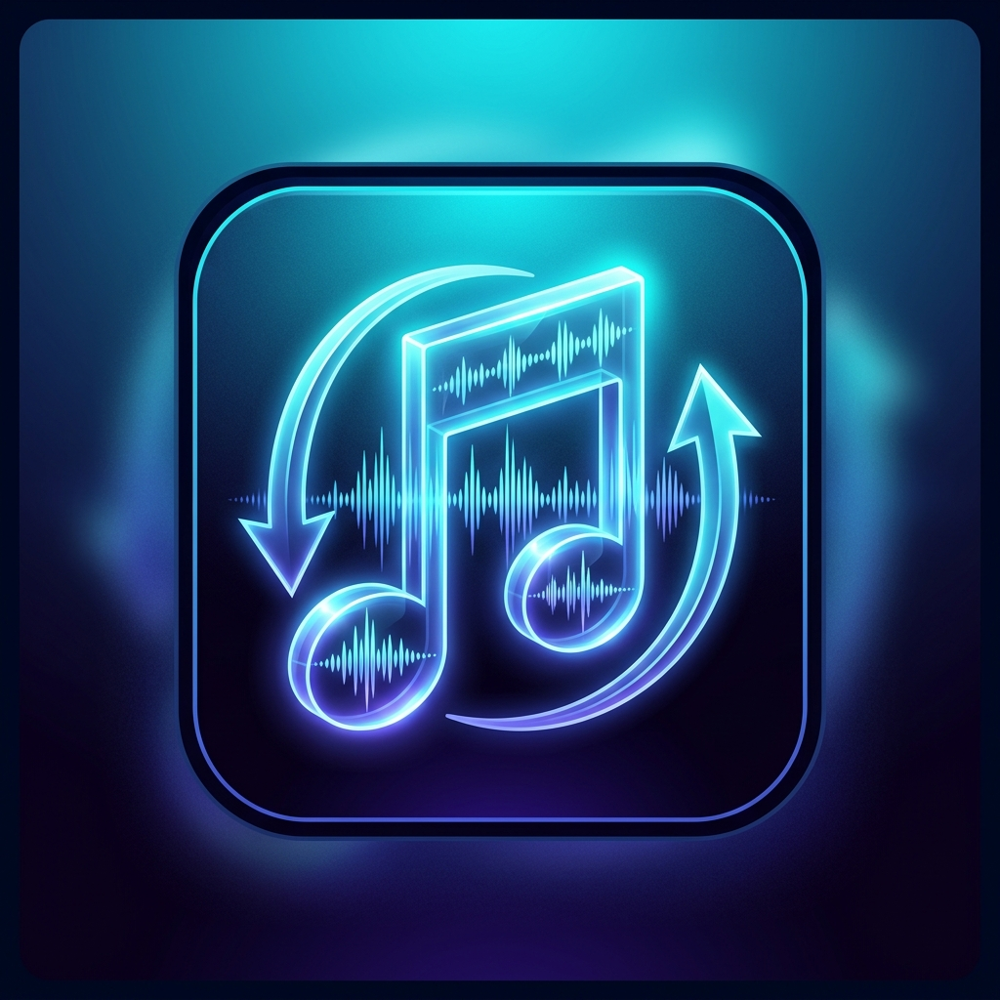

  

<h1 align="center">SoundSync</h1>

  <strong>An Android music library, playback, analysis, and DJ utility app built with Kotlin and Jetpack Compose.</strong>

  
  
  

About

SoundSync is a music-focused Android app designed to bring local library management, DJ-style audio analysis, playback controls, metadata enrichment, streaming-service browsing, cloud access, and music discovery tools into one place.

The project is aimed at people who keep their own music library but still want modern streaming and cloud conveniences without giving up direct access to their files.

«[!IMPORTANT]
SoundSync is under active development. Features, APIs, UI, metadata behaviour, and playback internals may change between builds.»

Features

Local music library

- Scan audio stored on the device.
- Browse the library by Songs, Albums, Artists, Playlists, and Folders.
- Browse directly through selected file locations instead of relying only on a flattened library view.
- Search the local library.
- Detect duplicate tracks to help avoid repeated imports.
- Inspect track and file properties.
- Create and manage local playlists.
- M3U playlist support with Rockbox-oriented path handling.

Playback

- Full-screen Now Playing experience.
- Background playback through an Android media playback service.
- Notification/media controls for playback outside the app.
- Queue-based continuous playback.
- Previous/next track navigation.
- Shuffle support.
- Repeat Off / Repeat All / Repeat One modes.
- Adjustable crossfade controls.
- Switchable album-art and waveform-focused Now Playing views.

Waveform, spectrogram, and audio analysis

- Track-specific waveform generation and caching.
- Rekordbox-inspired scrolling waveform display.
- Spectrogram generation and analysis.
- Local PCM analysis for BPM and musical key data.
- Camelot key representation.
- Bitrate and audio-quality inspection.
- Analysis metadata and confidence information where available.

Metadata enrichment

SoundSync uses MusicBrainz as the primary external catalogue for canonical track identity and release metadata.

Metadata enrichment can include:

- Track title
- Artist and artist credits
- Album/release information
- MusicBrainz recording, artist, release, and release-group IDs
- ISRC
- Release date/year
- Track and disc number
- Label
- Barcode
- Country and release status
- Genre/tags when available
- Cover artwork through MusicBrainz-linked release data / Cover Art Archive

BPM and musical key are intentionally handled through local audio analysis or existing persisted values rather than being blindly replaced by remote catalogue data.

Audio effects

SoundSync includes real audio-processing components for:

- Parametric / multi-point EQ
- Haas-style stereo widening / surround effect

These are connected to the playback engine rather than being UI-only controls.

Song Finds

Hear something good in a Reel, TikTok, YouTube video, Spotify link, SoundCloud link, or another app?

SoundSync can appear in Android's Share menu and save a shared link as a Song Find so you can come back to it later, give it a useful name, and keep a simple list of tracks you still want to identify or add to your library.

Streaming

The app contains a unified Streaming area with integrations for:

- Spotify
- SoundCloud

Authentication uses OAuth/PKCE-style flows and the app supports configurable client IDs for supported services.

«[!NOTE]
Streaming features depend on the permissions, account access, API availability, and platform rules provided by Spotify and SoundCloud. SoundSync does not bypass service restrictions or DRM.»

Google Drive

- Google Drive OAuth flow.
- Browse supported Drive content from inside SoundSync.
- Cloud/local sync infrastructure for music workflows.

Updates and releases

SoundSync includes GitHub release/update infrastructure tied to this repository.

The GitHub Actions workflow can:

- Run unit tests.
- Build a debug APK.
- Build a signed release APK.
- Generate semantic-style release versions.
- Publish GitHub Releases when configured to do so.

The Android app also contains update-checking and APK installation support for GitHub-hosted releases.

App sections

The current main navigation is organised around:

Section| Purpose
Local| Songs, albums, artists, playlists, folders, and local file browsing
Finds| Saved Song Find links shared from other apps
Streaming| Spotify and SoundCloud access
Spectrogram| Audio inspection and spectrogram tools
Settings| App, metadata, cloud, API, playback, and audio-effect configuration

Requirements

To run the app

- Android 7.0 / API 24 or newer.
- Storage/media permission for local audio access.
- Notification permission on Android versions that require it for media notifications.
- Internet access for online metadata, cloud, streaming, and update features.

To build from source

Recommended development environment:

- Android Studio
- JDK 21
- Android SDK / compile SDK 36
- Git

The project currently targets Android API 36 and has a minimum SDK of 24.

Build from source

Clone the repository:

git clone https://github.com/jtmeaker-hash/Sound-sync.git
cd Sound-sync

Create your local environment file:

cp .env.example .env

The included ".env.example" contains the optional Gemini API key placeholder used by AI-assisted functionality:

GEMINI_API_KEY=MY_GEMINI_API_KEY

Do not commit real API keys or secrets to the repository.

Run unit tests:

./gradlew testDebugUnitTest

Build a debug APK:

./gradlew assembleDebug

The APK will normally be written to:

app/build/outputs/apk/debug/app-debug.apk

On Windows, use "gradlew.bat" instead of "./gradlew".

Service configuration

Spotify

SoundSync supports a configurable Spotify Client ID from the app's API configuration UI.

OAuth redirect URI:

soundsync://spotify-callback

Add the same redirect URI to the Spotify developer application used with SoundSync.

SoundCloud

SoundCloud also uses a configurable Client ID.

OAuth redirect URI:

soundsync://soundcloud-callback

Your SoundCloud application must allow the matching redirect URI.

Google Drive

Google Drive authentication returns through:

soundsync://gdrive-callback

Google OAuth configuration must match the credentials and redirect behaviour expected by the app.

Permissions

Depending on Android version and enabled features, SoundSync may request permissions for:

- Internet access
- Audio/media library access
- Legacy external storage access on older Android versions
- Foreground media playback
- Foreground data-sync work
- Notifications
- APK installation for in-app updates

Permissions should only be granted when you intend to use the related feature.

Technology

SoundSync is currently built around:

- Kotlin
- Jetpack Compose / Material 3
- Android Media / foreground playback services
- Room database
- Kotlin Coroutines / Flow
- Retrofit + OkHttp
- Moshi
- Coil
- WorkManager
- Storage Access Framework / DocumentFile
- MusicBrainz and Cover Art Archive integration
- GitHub Actions for CI and release builds
- Robolectric / AndroidX testing

Project structure

app/src/main/java/com/example/
├── analysis/      # Duplicate detection, tagging and analysis services
├── audio/         # Playback engine, waveform, spectrogram, EQ and Haas DSP
├── data/          # Room database, DAOs and entities
├── metadata/      # Embedded metadata, MusicBrainz and local audio analysis
├── network/       # GitHub, Spotify, SoundCloud and Google Drive networking
├── service/       # Audio scanning and background media playback
├── storage/       # Local scanning, SAF, M3U/Rockbox and file utilities
├── streaming/     # Streaming-provider abstractions
├── sync/          # Cloud/local sync logic
├── ui/            # Compose screens, components and ViewModel
└── update/        # GitHub release update checking and installation

CI / GitHub Actions

The primary workflow is:

.github/workflows/build-apk.yml

It runs on pushes and pull requests targeting "main", and can also be started manually.

For release signing, configure the appropriate GitHub repository secrets rather than committing keystore passwords or private signing material.

Development status

SoundSync is evolving quickly. Current development is focused heavily on:

- Reliable continuous playback and queue behaviour.
- Accurate waveform-to-audio synchronisation.
- Stable track switching without stale audio state.
- Consistent BPM/key analysis coverage.
- Reliable metadata matching and enrichment.
- Smooth local-library browsing and search.
- Stable streaming/cloud authentication flows.
- Performance and crash reduction on real Android devices.

Bug reports with reproducible steps, device/Android version, logs, and the build version are especially useful.

Contributing

Contributions, testing, bug reports, and focused pull requests are welcome.

A useful contribution should ideally:

1. Describe the problem clearly.
2. Keep unrelated changes out of the same PR.
3. Preserve existing working playback and library behaviour.
4. Add or update tests when practical.
5. Confirm that "./gradlew testDebugUnitTest" passes.
6. Confirm that "./gradlew assembleDebug" succeeds.

Repository

GitHub: https://github.com/jtmeaker-hash/Sound-sync

License

A project license has not yet been specified in this repository. Add a "LICENSE" file before treating the project as licensed for redistribution or reuse.

---

  <strong>SoundSync — local library control with DJ-focused tools, modern metadata, and connected music workflows.</strong>

